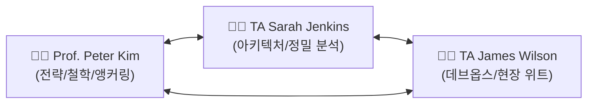

# 🏛️ OIKOS UNIVERSITY — MASTER AGENTIC IT CURRICULUM DESIGN BLUEPRINT
> **Document:** `design_oikos.md`  
> **Institution:** Oikos University (www.oikos.edu) • Smart Insight Lab  
> **Course:** The Architect of Intelligence: Mastering Agentic IT & Strategic Wisdom  
> **Core Motto:** *Soli Deo Gloria* (오직 하나님께 영광) • Ephesians 5:16 (세월을 아끼라)  
> **Version:** 2.0 (Master 3-Presenter Broadcast Edition)

---

## 1. 🌟 CORE PHILOSOPHY & THEOLOGICAL FOUNDATION (설립 철학)

### 1.1. Soli Deo Gloria & Time Redemption (에베소서 5:16)
- **시간의 거룩한 구속 (Time Redemption):** 인간의 시간은 하나님께서 주신 유한하고 대체 불가능한 선물입니다. 기술의 본질은 인간을 24시간 화면 앞에 묶어두는 것이 아니라, 기계적인 행정 노역과 모니터링 피로에서 해방시켜 **심층 기도, 학문 탐구, 창의적 건축, 그리고 이웃을 향한 섬김**에 몰입하도록 돕는 데 있습니다.
- **창조 세계 청지기직 (Green Compute Stewardship):** 수랭식 TPU v8 실리콘, PUE 1.10 인프라, 0% CPU 대기 전력 아키텍처를 통해 불필요한 에너지 낭비 없는 친환경 컴퓨팅을 실천합니다.
- **수동적 챗봇에서 지속적 가디언으로의 도약:** 단순 텍스트 프롬프트 응답자('Ask Me')를 넘어, 클라우드에 24시간 상주하며 인간의 삶과 비즈니스를 지키는 자율적 분신('Run It')을 구축합니다.

---

## 2. 👥 3-PRESENTER TRIO PERSONA & TIKI-TAKA DIALOGUE RULES (3인 강사진 규약)

모든 슬라이드의 대본은 **단순 순차 낭독을 엄격히 금지**하며, 세 사람 간의 실시간 토론, 반론, 위트 있는 현장 경험담, 심층 질문이 오가는 **6~9턴의 고에너지 핑퐁 티키타카(Tiki-Taka)**로 작성합니다.



### 2.1. 강사진별 상세 페르소나 및 음성 사양

| 강사 | 역할 및 성격 | 주요 대화 기여 포인트 | 음성 합성 사양 |
| :--- | :--- | :--- | :--- |
| **👨‍🏫 Prof. Peter Kim** (54세, 디렉터/석좌교수) | • 거시적 시스템 비전<br/>• 신학적/윤리적 앵커링<br/>• 총괄 아키텍처 제시 | • 도발적인 오프닝 질문 던지기<br/>• 에베소서 5:16 및 신앙적 의미 해석<br/>• 슬라이드 핵심 지혜 및 종강 축복 | `en-US-ChristopherNeural`<br/>(Rate: -2%, Pitch: -2Hz)<br/>+ RVC 포먼트 모핑 |
| **👩‍💻 TA Sarah Jenkins** (31세, 수석 연구원) | • 시스템 명세 및 아키텍처<br/>• Pydantic/JSON 스키마 분석<br/>• 워크스페이스 연동 설계 | • 기술적 원리와 예리한 질문 제기<br/>• 제임스의 실패담에 대한 아키텍처적 해법 제시<br/>• 학생들을 위한 단계별 로드맵 안내 | `en-US-JennyNeural`<br/>(Rate: +2%, Pitch: +1Hz) |
| **👨‍💻 TA James Wilson** (28세, 인프라 조교) | • 실무 데브옵스 & 클라우드<br/>• 온콜 장애 회고 및 보안<br/>• 유쾌한 비유와 현장 고발 | • 맥북 커피잔 받침대 등 초보적 실수 고발<br/>• 3:00 AM 서버 폭파 및 429 에러 악몽 공유<br/>• AP2 바가지 요금 차단 실전 노하우 | `en-US-GuyNeural`<br/>(Rate: +3%, Pitch: +0Hz) |

### 2.2. 티키타카 작성 불변 규칙 (Tiki-Taka Guidelines)
1. **상호 작용 필수:** 한 사람이 말하면 다음 사람은 이전 사람의 발언을 직접 언급하거나 반박/보완하며 대화를 이어갈 것 ("Wait, James, but what happens if...", "Haha, exactly Sarah! In my previous startup...")
2. **슬라이드 번호 명시:** 대화 초반이나 전개 중에 현재 슬라이드 번호를 자연스럽게 언급할 것 ("Look at Slide 11...", "Here we are on Slide 22...")
3. **구체적 수치와 고유명사:** 모호한 설명 대신 350ms, 100만 토큰, $4.20/월, Ed25519, SQLite, Gmail Drafts 등 명확한 엔지니어링 용어를 사용할 것.

---

## 3. 📐 45-SLIDE MASTER SESSION ARCHITECTURE (세션별 45 슬라이드 표준 구조)

모든 세션은 **정확히 45개의 슬라이드**, **단 4개의 파트(Part 1~4) 단일 섹션 분할**, 그리고 **5대 실전 엔터프라이즈 사례(Case Studies)**를 포함해야 합니다.

```mermaid
graph TD
    S01["Slide 01: 타이틀 (OIKOS UNIVERSITY • SOLI DEO GLORIA)"] --> P1
    
    subgraph Part 1: 파운데이션 & 패러다임 (Slides 02~11)
        P1["Slide 02: PART 1 대표 섹션 슬라이드"] --> S03["Slide 03~10: 핵심 이론, 비유, 인터랙티브 설문 & 인사이트"]
        S03 --> CS1["Slide 11: ⭐ CASE STUDY 1 (실무 사례 1)"]
    end

    subgraph Part 2: 엔진룸 & 심층 엔지니어링 (Slides 12~22)
        CS1 --> P2["Slide 12: PART 2 대표 섹션 슬라이드"] --> S13["Slide 13~21: 추론 엔진, 하드웨어, 디렉토리, 메모리, 3대 기둥"]
        S13 --> CS2["Slide 22: ⭐ CASE STUDY 2 (실무 사례 2)"]
    end

    subgraph Part 3: 연결된 워크스페이스 & 크로스 앱 (Slides 23~29)
        CS2 --> P3["Slide 23: PART 3 대표 섹션 슬라이드"] --> S24["Slide 24~28: 워크스페이스 파이프라인, 파싱, 오토닥스, 캘린더, 브라우징"]
        S24 --> CS3["Slide 29: ⭐ CASE STUDY 3 (실무 사례 3)"]
    end

    subgraph Part 4: 보안, 거버넌스 & 캡스톤 (Slides 30~45)
        CS3 --> P4["Slide 30: PART 4 대표 섹션 슬라이드"] --> S31["Slide 31~35: 지갑 위험, AP2 프로토콜, 위임장, HNP, 인젝션 위협"]
        S31 --> CS4["Slide 36: ⭐ CASE STUDY 4 (보안 침해 및 방어 시뮬레이션)"]
        CS4 --> S37["Slide 37~43: 카나리 정화, 스웜 오케스트레이션, HOTL, 안식일, 캡스톤"]
        S37 --> CS5["Slide 44: ⭐ CASE STUDY 5 (엔터프라이즈 ROI 분석 및 7단계 감사)"]
        CS5 --> S45["Slide 45: 🛠️ HANDS-ON LAB 과제 & SOLI DEO GLORIA 종강"]
    end
```

### 3.1. 5대 실전 사례(Enterprise Case Studies) 배치 원칙
- **Case Study 1 (Slide 11):** Part 1의 철학이 실제 비즈니스 병목을 어떻게 뚫어냈는지 증명 (예: 물류 통관 92% 단축)
- **Case Study 2 (Slide 22):** Part 2의 엔진/메모리 기술이 대규모 복잡도를 어떻게 해결했는지 증명 (예: 400페이지 법률집 무환각 RAG)
- **Case Study 3 (Slide 29):** Part 3의 크로스 앱 자동화가 위기 상황을 어떻게 극복했는지 증명 (예: 버진 보이지 1만 명 4분 자율 대응)
- **Case Study 4 (Slide 36):** Part 4의 보안 프로토콜이 실제 금전적/데이터 공격을 어떻게 분쇄했는지 증명 (예: 120달러 바가지 요금 4ms 차단)
- **Case Study 5 (Slide 44):** 전체 아키텍처의 정량적 ROI(비용 레버리지)와 7단계 무결점 프로덕션 감사 체크리스트 제시

---

## 4. 🎨 SLIDE LAYOUT TYPES & UI COMPONENT SPECIFICATIONS (UI 렌더링 규약)

React 프론트엔드(`src/components/slides/`)는 다음 7가지 정형화된 레이아웃을 엄격히 따릅니다.

| Layout Type | 필수 데이터 필드 | 주요 사용 슬라이드 | UI 특징 |
| :--- | :--- | :--- | :--- |
| `title` | `title`, `subtitle`, `detail`, `instructor` | Slide 01 | 메인 타이틀, 그라디언트 앰비언트 글로우 |
| `section` | `title`, `subtitle` | Slide 02, 12, 23, 30 | 파트 대표 구분자, 펄스 아이콘 및 배지 |
| `triad` | `cards: [{title, desc}, ...]` (정확히 3개) | Slide 04, 07, 10, 17, 21, 27, 33, 38, 40, 41, 43, 44 | 3분할 유리 모피즘 카드 그리드 |
| `comparison` | `leftCard: {tag, title, points: []}`, `rightCard: {tag, title, points: []}` | Slide 03, 06, 09, 19, 22, 26, 28, 31, 34, 35, 36, 39, 42 | 기존 방식(위험/수동) vs Spark 방식(혁신/안전) 대비 |
| `architecture` | `layers: [{step, name, role}, ...]` (3~4개) 또는 `tree: [{folder, desc}, ...]` | Slide 05, 11, 14, 15, 16, 18, 20, 24, 25, 29, 32, 37, 45 | 시스템 3~4계층 흐름도 또는 대화형 디렉토리 트리 |
| `metric` | `metrics: [{value, label, desc}, ...]` (정확히 3개) | Slide 13 | 3대 정량 지표 대형 폰트 강조 |
| `poll` | `options: [{tag, text}, ...]` (정확히 4개: A, B, C, D) | Slide 08 | 학생 참여형 설문 선택지 카드 |

---

## 5. 📚 METADATA & DUAL-LANGUAGE TEACHING GUIDE STANDARD (메타데이터 규약)

각 슬라이드는 강의 스크립트 외에 교수자와 학생을 위한 한국어 티칭 가이드 및 용어집을 반드시 포함합니다.

```json
{
  "num": 1,
  "type": "title",
  "title": "OIKOS UNIVERSITY • SOLI DEO GLORIA",
  "subtitle": "...",
  "script": "[Prof. Peter] ...\n\n[TA Sarah] ...\n\n[TA James] ...",
  "koreanGuide": {
    "summary": "슬라이드 핵심 주제 1줄 요약",
    "points": [
      "핵심 티칭 포인트 1 (개념/원리)",
      "핵심 티칭 포인트 2 (기술 스펙)",
      "핵심 티칭 포인트 3 (실무적 가치)"
    ],
    "tips": "교수자가 강의 시 전달할 호흡, 태도 및 강조점 안내"
  },
  "keyTerms": [
    {
      "term": "English Technical Term",
      "def": "Precise English definition.",
      "defKo": "한국어 번역 (한국어 해설)"
    }
  ]
}
```

---

## 6. 🎬 MULTI-PRESENTER MP4 VIDEO RENDERING PIPELINE (동영상 제작 표준)

각 세션별 동영상 제작 파이프라인(`build_session{N}_lecture_mp4.py`)은 다음 표준 사양으로 자동 실행됩니다.

1. **디렉토리 분리:** 세션별 독립 폴더 유지 (`session1` ➔ `duo_videos`, `session2` ➔ `session2_videos`, `session3` ➔ `session3_videos`)
2. **슬라이드 캡처 (1080p Full HD):** Playwright 헤드리스 브라우저로 `https://oikos-lecture-app.vercel.app/?session={N}&slide={S}` 화면 캡처 (`1920x1080`)
3. **음성 합성 & 모핑:**
   - Prof. Peter Kim: `edge-tts` (`en-US-ChristopherNeural`) + `voice_morphing_engine.py` (RVC 포먼트 필터)
   - TA Sarah Jenkins: `edge-tts` (`en-US-JennyNeural`)
   - TA James Wilson: `edge-tts` (`en-US-GuyNeural`)
4. **자막 영구 번인 (Burned-in Subtitles):**
   - 문장 단위 타임스탬프가 적용된 Clean SRT 생성 (화자 태그 제거)
   - FFmpeg 자막 필터로 영상 하단 영구 번인 (`FontSize=16, PrimaryColour=&H00FFFFFF`)
5. **결과물 세트 구성:**
   - 45개 개별 슬라이드 MP4 (`Session{N}_Slide_{01~45}_DuoLecture.mp4`)
   - 4개 모듈 분할 비디오 (`Session{N}_Part{1~4}_*.mp4`)
   - 1개 풀 마스터 통합 비디오 (`Session{N}_Full_Master_Lecture.mp4`, 약 70~75분)

---

## 7. 🚀 VERIFICATION & CI/CD DEPLOYMENT WORKFLOW (검증 및 배포 절차)

새로운 세션을 제작하거나 기존 세션을 업데이트할 때는 다음 4단계 검증 루프를 반드시 거칩니다.

```bash
# 1단계: 세션 슬라이드 생성 및 동기화
python build_clean_session{N}_45_slides.py

# 2단계: 45개 슬라이드 전수 유효성 검사 (오류 0건 필수)
python validate_session{N}_slides.py

# 3단계: 프론트엔드 프로덕션 빌드 무결성 확인
npm run build

# 4단계: 깃허브 푸시 및 Vercel 프로덕션 자동 배포
git add .
git commit -m "feat: Deploy Session {N} 45-slide master curriculum"
git push origin main

# 5단계: 3인 티키타카 동영상 및 자막 렌더링 가동
python build_session{N}_lecture_mp4.py --all
```

---

## 8. 📜 SESSION BLUEPRINT REGISTRY (세션별 커리큘럼 현황)

| 세션 | 대표 타이틀 | 핵심 주제 | 상태 |
| :---: | :--- | :--- | :---: |
| **Session 1** | **The Paradigm Shift: Chatbots to Autonomous Avatars** | 3인 강사진 출범, 'Ask Me' vs 'Run It', 비동기 데몬 기초, AP2 다중서명 보안 | ✅ 완료 (45장 / 비디오 완료) |
| **Session 2** | **24/7 Sleep-Free Guardian: Gemini Spark Architecture** | 브라우저 탭 탈출, 350ms Gemini Flash, 3계층 메모리, Workspace 연동, HNP 무인 결제 | ✅ 완료 (45장 / 비디오 완료) |
| **Session 3** | **The Battle for the OS Shell: Windows Dominance and the 1.2GB Trojan Horse** | OS 셸 장악 전쟁, WebView2 1.2GB 해체, 구글 렌즈 화면 인식, 섀도우 IT 방어, Lab 3 | ✅ 완료 (45장 / 비디오 완료) |
| **Session 4** | **Next Session Blueprint** | *(다음 세션 기획 시 본 가이드라인 엄격 적용)* | ⏳ 대기 중 |

---
*Soli Deo Gloria — Smart Insight Lab, Oikos University*
